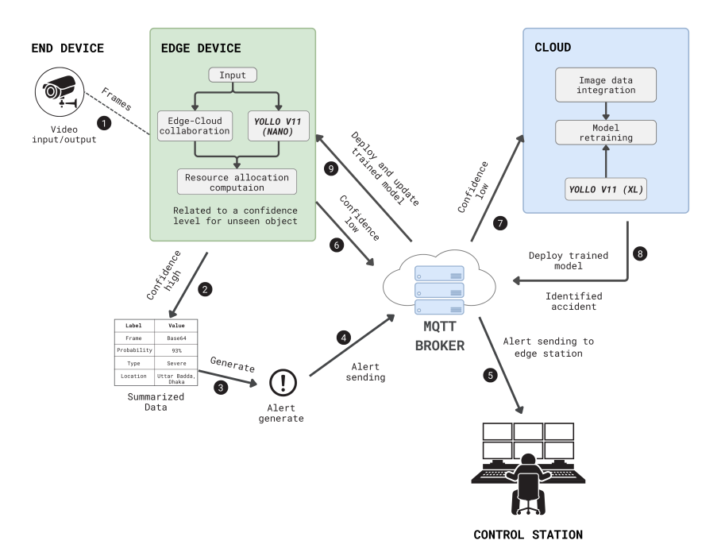

# 🚨 Real-Time Traffic Accident Detection & Alert System

This project is an intelligent, real-time accident detection and alert system that leverages **CCTV traffic camera feeds**, **YOLOv11-based deep learning**, and **edge computing** to identify road accidents and immediately notify emergency services.

Designed for smart city integration, it enhances road safety by enabling rapid incident response using automated classification and communication technologies.

## 🧠 System Overview

- 🎥 **Input**: Live footage from traffic surveillance cameras.
- 🤖 **Edge AI**: A **YOLOv11** model runs on an **edge device**, trained to detect and classify road incidents into:
  - `No Accident`
  - `Moderate Accident`
  - `Severe Accident`
- 🔔 **MQTT Messaging**: On detection of an accident, an MQTT message is triggered.
- 🏥 **Automated Alerts**: The alert is instantly sent to the nearest:
  - Police Station
  - Hospital
  - Fire Service
- 🌐 **Web Dashboard**: Real-time updates are displayed on a connected website using **WebSocket**, allowing live monitoring by emergency services or traffic control centers.

## ✅ Key Features

- 🚗 **Accident Classification using YOLOv11**  
  Trained on real-world footage for reliable severity estimation.

- 📡 **Edge Device Deployment**  
  Ensures low-latency processing and decision-making near the source.

- 🔄 **Real-Time Alert Dispatch via MQTT**  
  Lightweight protocol ideal for low-bandwidth, high-speed emergency messaging.

- 🌐 **WebSocket-Driven Live Monitoring Dashboard**  
  Allows command centers and authorities to view alerts instantly as they occur.

## 🎯 Benefits

- ⏱️ Drastically reduces emergency response time.
- 🧠 Intelligent classification avoids false positives.
- 🌍 Enhances smart city safety infrastructure.
- 🧩 Easily integrable with existing surveillance networks and emergency systems.

This project bridges AI and public safety by enabling real-time surveillance automation with direct, actionable outcomes.
